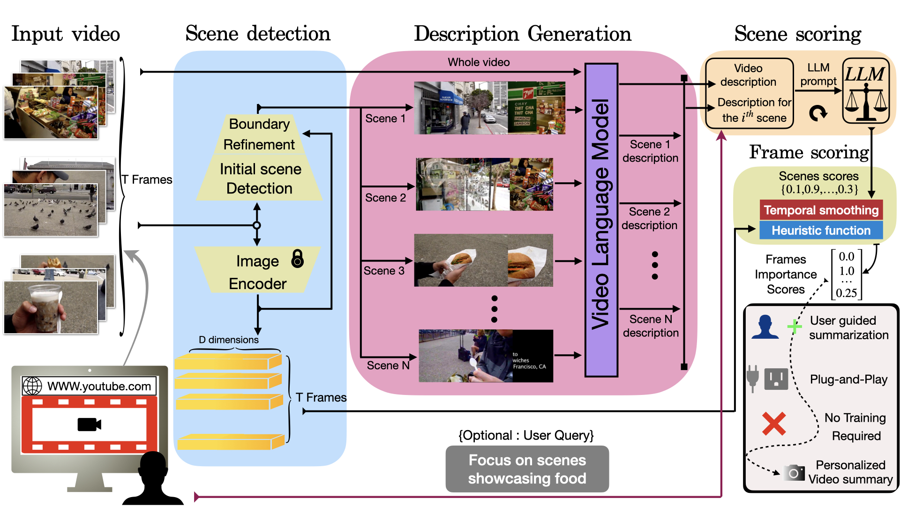

# Prompts to Summaries: Zero‑Shot Language‑Guided Video Summarization
This is the offical implementation of the paper : [Prompts to Summaries: Zero‑Shot Language‑Guided Video Summarization](https://arxiv.org/abs/1234.56789)\


---

## Table of Contents
- [Requirements](#requirements)
- [Installation](#installation)  
- [How to Run](#how-to-run)  
- [License](#license)  
- [Contact](#contact)  

---
## Requirements
*
*
*
*
*
*
## Installation

Step-by-step instructions to get your project set up locally.

```bash
# Clone the repo
git clone https://github.com/yourusername/your-repo.git

# Navigate into the directory
cd your-repo

# Install dependencies
pip install -r requirements.txt
```

---
  
## How to Run


---
## License


---
## Contact
E-mail : mario.bar98@gmail.com
